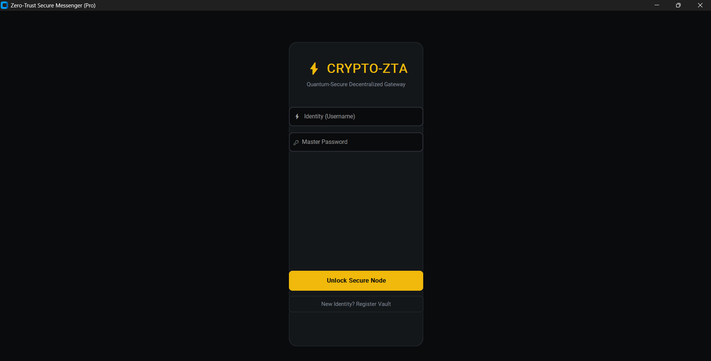
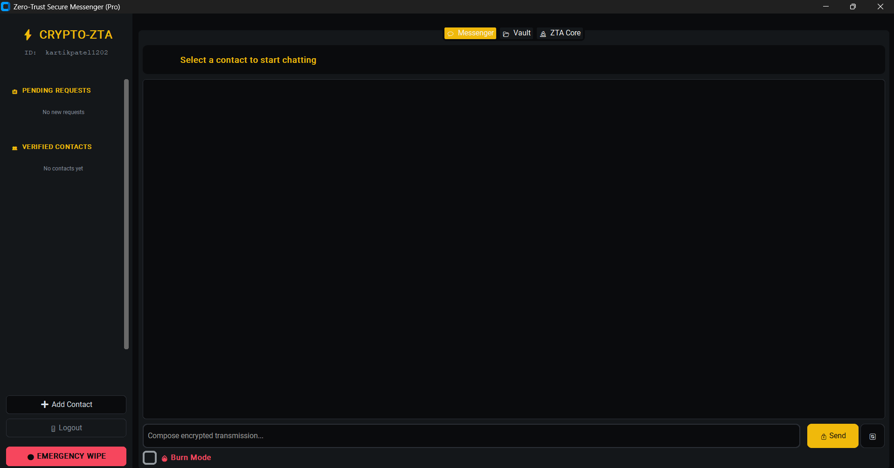
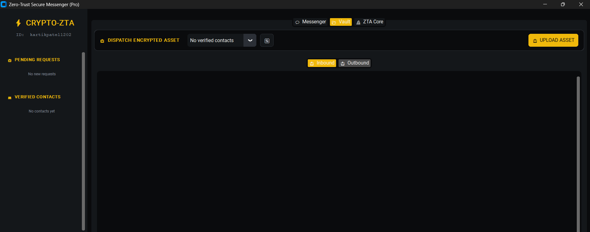

# 🛡️ Zero Trust Secure Messaging Platform

> A secure messaging platform implementing **Zero Trust Architecture (ZTA)** with **X25519 Key Exchange**, **AES-256-GCM Encryption**, **Merkle Tree Identity Verification**, and **Supabase Cloud Integration** for secure communication and encrypted file sharing.

---

## 📖 Overview

Traditional messaging systems trust authenticated users once they log in. This project follows the **Zero Trust Security Model**, where every user, device, and communication request is continuously verified before access is granted.

The platform enables users to securely communicate, exchange encrypted files, and establish trusted connections using cryptographic identity verification.

The project combines modern cryptographic techniques with cloud storage to ensure confidentiality, integrity, and authenticated communication.

---

## ✨ Key Features

### 🔐 Zero Trust Authentication

- Continuous identity verification
- Secure login workflow
- Device context validation
- Trust-based access control

---

### 🌳 Merkle Tree Identity Verification

- Cryptographic identity proofs
- Tamper-resistant verification
- Secure user authentication
- Prevents identity spoofing

---

### 🔑 X25519 (XDH) Secure Key Exchange

- Diffie-Hellman Key Exchange
- Forward Secrecy
- Shared secret generation
- Secure session establishment

---

### 💬 End-to-End Encrypted Messaging

- AES-256-GCM encryption
- Authenticated encryption
- Message confidentiality
- Integrity verification

---

### 📂 Secure File Vault

- Encrypted file upload
- Secure cloud storage
- File download & decryption
- Protected document sharing

---

### 🤝 Secure Connection Handshake

Before communication begins:

- User Identity Verification
- Merkle Tree Validation
- Trust Score Verification
- Secure Session Creation

---

### ☁️ Supabase Integration

- PostgreSQL Database
- User Authentication
- Secure Cloud Storage
- REST API Communication

---

# 🏗️ System Architecture

```text
                    React Frontend
                          │
                          ▼
                   Flask REST API
                          │
        ┌─────────────────┼─────────────────┐
        │                 │                 │
   X25519 Key        Merkle Tree       AES-256-GCM
     Exchange         Verification      Encryption
        │                 │                 │
        └─────────────────┼─────────────────┘
                          │
                    Supabase Cloud
           (Auth + Database + Storage)
```

---

# ⚙️ Tech Stack

| Category | Technology |
|-----------|------------|
| Frontend | React + Vite |
| Backend | Flask |
| Database | PostgreSQL (Supabase) |
| Authentication | Supabase Auth |
| Cryptography | X25519 (XDH) |
| Encryption | AES-256-GCM |
| Identity Verification | Merkle Tree |
| Cloud Storage | Supabase Storage |
| Programming Languages | Python, JavaScript |

---

# 📸 Project Screenshots

## 🔐 Login Interface

Secure authentication interface implementing Zero Trust login workflow.



---

## 💬 Secure Messaging Dashboard

Real-time encrypted communication between verified users.


## 📂 Secure Vault

Encrypted file upload and secure cloud storage.



---


# 🚀 Installation

## Clone Repository

```bash
git clone https://github.com/Kartikpatel1202/Zero-Trust-Application-Security-System.git

cd Zero-Trust-Application-Security-System/crypto
```

---

# Backend Setup

Install dependencies

```bash
pip install -r requirements.txt
```

Create a `.env` file

```env
SUPABASE_URL=your_supabase_url
SUPABASE_KEY=your_service_role_key
```

Run the backend

```bash
cd backend

python app.py
```

Backend Server

```
http://127.0.0.1:5000
```

---

# Frontend Setup

```bash
cd frontend

npm install

npm run dev
```

Frontend

```
http://localhost:3000
```

---

# Database Schema

### Users

| Field | Type |
|-------|------|
| id | UUID |
| username | TEXT |
| public_key_hex | TEXT |
| merkle_leaf_hash | TEXT |
| trust_score | INTEGER |

---

### Connections

| Field | Type |
|-------|------|
| id | UUID |
| requester_username | TEXT |
| receiver_username | TEXT |
| status | TEXT |

Status

- pending_verification
- verified

---

### Messages

| Field | Type |
|-------|------|
| id | UUID |
| sender_username | TEXT |
| recipient_username | TEXT |
| ciphertext_b64 | TEXT |
| nonce_b64 | TEXT |
| timestamp_b64 | TEXT |

---

# 🔄 Workflow

```
User Login
      │
      ▼
Identity Verification
      │
      ▼
Merkle Tree Proof
      │
      ▼
X25519 Key Exchange
      │
      ▼
AES-GCM Session Key
      │
      ▼
Secure Communication
      │
      ▼
Encrypted Cloud Storage
```

---

# 📂 Project Structure

```
crypto
│
├── backend/
│
├── frontend/
│
├── interface/
│
├── core/
│
├── network/
│
├── database/
│
├── utils/
│
├── app.py
│
├── requirements.txt
│
└── README.md
```

---

# 🔒 Security Features

✔ Zero Trust Authentication

✔ X25519 Key Exchange

✔ AES-256-GCM Encryption

✔ Merkle Tree Identity Verification

✔ Secure Session Establishment

✔ Encrypted File Storage

✔ Secure Cloud Database

✔ Protected REST APIs

---

# 📈 Future Enhancements

- Group Messaging
- Multi-Factor Authentication
- Real-Time WebSocket Communication
- Voice & Video Calls
- Mobile Application
- Push Notifications
- Multi-Device Synchronization
- End-to-End Encrypted Backup

---

# 👨‍💻 Author

**Kartik Patel**

B.Tech Computer Science Engineering

VIT Chennai

---

## ⭐ Support

If you found this project useful, consider giving the repository a **Star ⭐**.
